# HES — Hybrid Energy System

**Hybrid renewable energy system sizing, from geographic resource data to a single-line diagram.**

Give it a location and an hourly load profile. It fetches the solar and wind
resource for that point, searches for the Pareto-optimal combination of PV,
wind, battery, EV charging, generator and grid capacity, then works the chosen
design up into a full electrical specification — inverters, string layouts,
cables, protection, isolation — and draws it.

**▶ Live demo — no installation:** https://emadroshandel.github.io/Hybrid_Energy_System/

[](LICENSE)
[](https://www.python.org/)
[](requirements.txt)
[](tests/)
[](#13-twenty-technologies-four-behaviours-one-loop)

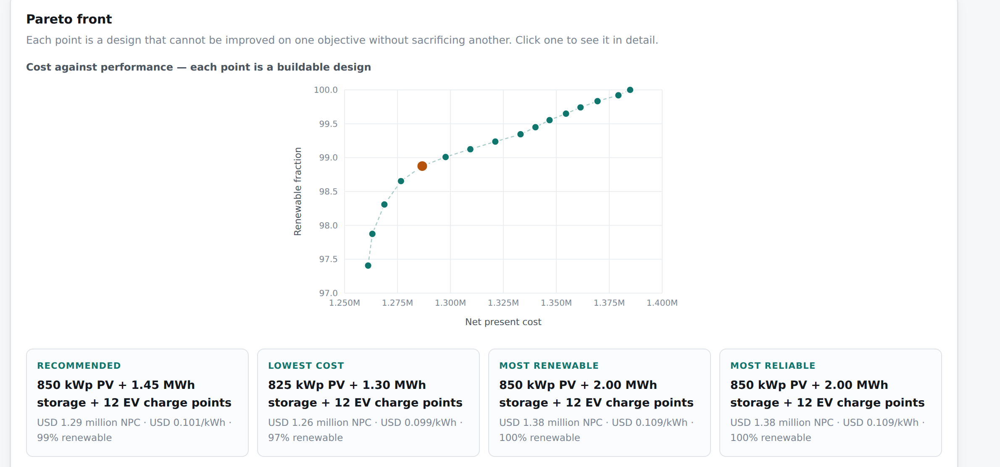

<sub>Sixteen designs that cannot be improved on one objective without giving something up on another — the output of a 30-second study on a 300 kW commercial site.</sub>

*Engineering and methods by **Emad Roshandel**. Software and interface by
**Claude (Opus)**. What that division means, and why it is worth stating, is
in [Authorship](#authorship).*

Python 3.9+, **standard library only**. No installation, no dependencies, no
build step. It runs as a desktop window, a local server, over your network, or
entirely client-side in a browser through Pyodide. 

---

## Contents

- [Install](#install)
- [Quick start](#quick-start)
- [Worked examples](#worked-examples)
- [What it does](#what-it-does)
- **[Part 1 — The concepts](#part-1--the-concepts)** — what hybrid sizing is, and why it is done this way
  - [1.1 What "sizing" actually means](#11-what-sizing-actually-means)
  - [1.2 Why the answer is a curve, not a number](#12-why-the-answer-is-a-curve-not-a-number)
  - [1.3 Twenty technologies, four behaviours, one loop](#13-twenty-technologies-four-behaviours-one-loop)
  - [1.4 The money: NPC and LCOE](#14-the-money-npc-and-lcoe)
  - [1.5 The service: LPSP and the four "renewable" numbers](#15-the-service-lpsp-and-the-four-renewable-numbers)
  - [1.6 Flexible demand: six ways to charge the same cars](#16-flexible-demand-six-ways-to-charge-the-same-cars)
  - [1.7 From kilowatts to copper](#17-from-kilowatts-to-copper)
- **[Part 2 — Using the software](#part-2--using-the-software)** — a page-by-page walkthrough
- **[Part 3 — A worked example, end to end](#part-3--a-worked-example-end-to-end)**
- **[Part 4 — Under the hood](#part-4--under-the-hood)** — layout, API, extending it
- [Relationship to the MATLAB study](#relationship-to-the-matlab-study)
- [Validation and tests](#validation-and-tests)
- [Running it online](#running-it-online)
- [Limits worth knowing](#limits-worth-knowing)
- [Troubleshooting](#troubleshooting)
- [Contributing](#contributing)
- [Authorship](#authorship)
- [Citation](#citation)
- [Licence and attribution](#licence-and-attribution)

---

## Install

There is nothing to install. The engine, the hourly dispatch, the optimisers,
the server, the charts and the report generator are written against the Python
standard library, so a clean Python 3.9 or newer is the whole requirement.

```bash
git clone https://github.com/emadroshandel/Hybrid_Energy_System.git
cd Hybrid_Energy_System
python server.py
```

Two optional extras, and the program says so when either is missing rather
than failing:

```bash
pip install numpy       # faster on large studies; identical results
pip install pywebview   # the native desktop window used by desktop.py
```

On Windows nothing needs a terminal at all: **`START_HES.bat`** opens the
browser application and **`Run HES (desktop).bat`** opens the native
window. If your security software blocks batch files, double-click
**`START_HES.py`** instead. On Linux and macOS, `./run.sh`.

If anything is wrong with the installation, `python doctor.py` names it:

```bash
python doctor.py            # full report
python doctor.py --quiet    # only problems; exit code 1 if any
```

---

## Quick start

```bash
python server.py                 # localhost, opens a browser
python server.py --network       # also reachable from your LAN
python server.py --port 8080     # pick the port
python desktop.py                # native window (needs pywebview)
python -m unittest discover -s tests   # 207 regression tests
```

On Windows, `START_HES.bat` does all of this from a double-click: it finds
Python, runs `doctor.py`, starts the server and keeps the window open so an
error is on screen rather than gone with a console that closed itself.

`--network` prints every address the machine is reachable on and warns that
there is no authentication — appropriate for a design office, not for the open
internet.

**No network at all?** Open `web/index.html` directly. The page loads Pyodide
and runs the identical engine in the browser. And with no internet either,
twelve monthly irradiation totals are enough to get a full study — see
[step 1](#step-1--site) below.

---

## Worked examples

Three complete studies ship in [`examples/`](examples/). Press **Open project**
at the top right of any page and choose one. Opening a project restores the
site, the resource settings, the demand, the cost basis, every component field,
the economics and the search settings, then fetches the resource and rebuilds
the demand for you and stops on the Optimise page. Press **Run study**.

| File | What it is | Demand | Technologies |
|---|---|---|---|
| `01_house_rooftop.json` | A single dwelling in Shiraz with a grid connection | 5 kW peak, ≈15 MWh/yr | PV + battery + grid |
| `02_grid_tied_commercial.json` | A shop, clinic or small office on the same site | 100 kW peak, ≈394 MWh/yr | PV + battery + grid |
| `03_islanded_minigrid.json` | The same building supplied as an island | 100 kW peak, ≈394 MWh/yr | PV + battery + diesel |

None of them needs an internet connection: each carries twelve monthly
irradiation and temperature values and generates its own demand profile, so
they behave identically on an offline machine and in the browser-only version.
Start with the house — it is the shortest run, and it shows what a correct
answer looks like at household scale. If a house study ever comes back in MWp,
the demand profile is the first thing to check.

Your own studies save the same way: **Save project (JSON)** on the Report page.
See [`examples/README.md`](examples/README.md) for the two limits of the
format.

---

## What it does

**Resource data.** Global Solar Atlas for long-term averages, PVGIS (TMY or a
specific year), NASA POWER, Open-Meteo/ERA5, and Renewables.ninja. Responses are
cached on disk. The Atlas figures are always fetched alongside the hourly data
as an independent cross-check: if the hourly year's annual GHI disagrees with
the long-term average by more than 10%, the report says so rather than
proceeding quietly.

**Technologies.** Twenty, in seven groups, all sharing one dispatch loop:

| Group | Technologies |
|---|---|
| Solar | PV (fixed, single- and two-axis, bifacial, floating), CSP with thermal storage |
| Wind | Onshore, offshore and small wind, with power-curve or cubic models |
| Hydro | Run-of-river, reservoir with pondage |
| Marine | Tidal stream, wave energy |
| Dispatchable | Diesel and gas gensets, biomass/biogas, CHP, geothermal, fuel cell |
| Storage | Lithium (NMC, LFP, LTO), sodium-ion, lead-acid, nickel-iron, flow, pumped hydro, flywheel, supercapacitor, compressed air, thermal, hydrogen |
| Flexible load | EV fleets, six charging scenarios, five archetypes |

**Costs, worldwide.** Thirty-four technologies benchmarked across eleven regions
and nineteen currencies, every figure carrying its source and year. They are
published benchmarks, not quotations — installed cost varies by more than a
factor of two between comparable projects — so the engine records which numbers
came from the library and which you supplied, and the report shows the
difference.

**Sizing.** A Pareto front across whichever objectives you choose — net present
cost, LCOE, loss of power supply probability, renewable fraction, emissions,
capital — subject to hard constraints, with a choice of three search
algorithms. Decision variables are integer unit counts, because you buy three
turbines, not 5.7 MW of turbine.

**Electrical design.** Distribution voltage chosen from the plant rating rather
than assumed. Inverter rating from the actual clipping curve rather than a
rule-of-thumb DC/AC ratio. String layouts checked against both the cold-day
open-circuit maximum and the hot-day MPPT minimum. Conductors sized against
ampacity, voltage drop and short-circuit withstand, with the governing
criterion named. Protection coordinated so both IEC 60364-4-43 conditions hold.

**Output.** Single-line and three-line diagrams as themed SVG with IEC 60617
symbols, generated from the same design record as the schedules, so the drawing
cannot drift out of step with the numbers. A self-contained HTML report in
English or Persian.

**Persian.** A full translation, not a veneer: 197 strings at 100% coverage,
right-to-left layout, Persian-Indic digits with Arabic separators (۱٬۲۳۴٫۵),
and Iranian engineering terminology — کلید مدار for circuit breaker, دیاگرام
تک‌خطی for single-line diagram, هزینه تراز شده انرژی for LCOE. Loanwords already
used by Iranian engineers (اینورتر, الکترولایزر) are kept rather than replaced
by coinages nobody says.

---

# Part 1 — The concepts

*This part is about the engineering, not the software. If you already size
hybrid systems for a living, skip to [Part 2](#part-2--using-the-software).*

## 1.1 What "sizing" actually means

A hybrid system is a set of machines that between them have to serve a demand
that changes every hour, using resources that also change every hour and are
not correlated with the demand. Sizing is choosing **how many of each machine**
to buy.

That sounds like a spreadsheet exercise, and for a single technology it nearly
is. Add a second and it stops being one. A battery's value depends entirely on
what the PV does, which depends on the weather, which depends on the season;
the generator's value depends on how often the battery runs out, which depends
on how big it is; the grid connection's value depends on the tariff and on the
export limit, which caps what the PV is worth on a sunny Sunday. None of these
can be settled independently, and none of them can be settled from annual
totals — an annual energy balance will happily approve a system that fails
every evening in January.

So the only honest way to evaluate a candidate design is to **simulate a whole
year at hourly resolution** and see what actually happens. That is 8,760 energy
balances per candidate. Do it for a few hundred candidates and you have a
sizing study.

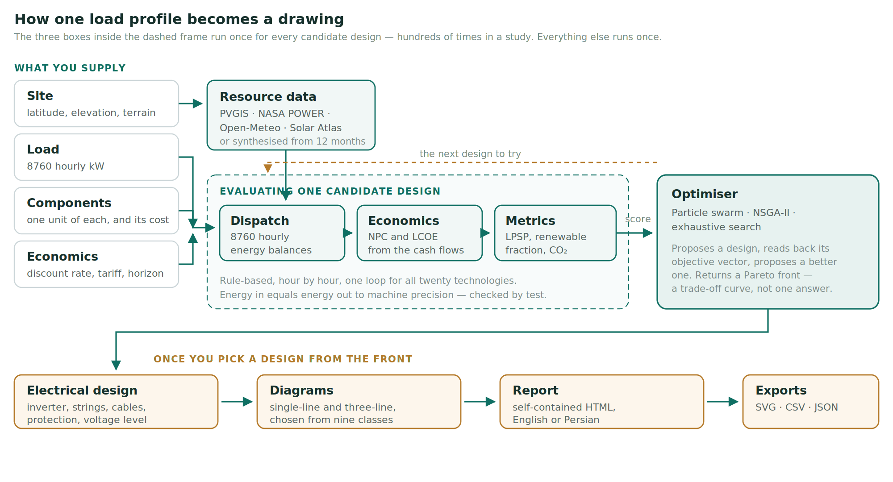

Everything in this tool follows from that diagram. The dispatch, economics and
metrics stages run once per candidate design and must therefore be fast and
exactly repeatable. The optimiser sits outside that loop and never learns
anything about energy — it only sees a vector of numbers to minimise. The
electrical design runs once, on the design you eventually choose.

## 1.2 Why the answer is a curve, not a number

Ask for "the optimal system" and you are implicitly asking a question with a
hidden parameter: optimal *for what*? Cheapest? Greenest? Most reliable? Those
are different systems, and no amount of computation will merge them into one.

The usual workaround is to weight them — 60% cost, 40% carbon — and minimise
the weighted sum. That produces a single answer, which is exactly the problem:
the weighting was a guess, it is now buried inside the result, and nobody
reading the report can see what it cost them.

HES reports the whole **Pareto front** instead.

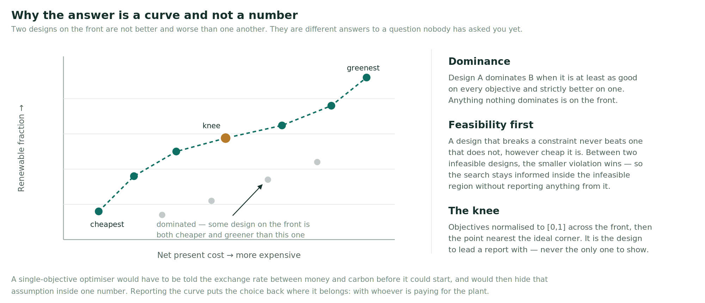

Reading a front takes a minute of practice and then becomes obvious. In the
screenshot at the top of this page, sixteen designs survived. The cheapest is
825 kWp of PV with 1.30 MWh of storage at USD 1.26 million and 97.4% renewable.
The greenest is 850 kWp with 2.00 MWh at USD 1.38 million and 100% renewable.
The last 2.6 percentage points of renewable energy cost USD 120,000 — about
USD 46,000 per point. Whether that is worth paying is not an engineering
question, and the tool does not pretend it is one. It shows you the price and
lets you decide.

The one design it does highlight is the **knee**: normalise every objective to
[0,1] across the front and take the point nearest the ideal corner. It is the
design to lead a report with. It is never the only one to show.

**Constraints are separate from objectives, and are handled first.** A design
that leaves 8% of demand unserved does not get to be "cheap" — it gets to be
infeasible. Between two feasible designs, dominance decides; between two
infeasible ones, the smaller violation wins, so the search stays informed
inside the infeasible region without ever reporting anything from it. (This is
Deb's constrained-dominance rule, and it is used everywhere in the code that
two designs are compared.)

## 1.3 Twenty technologies, four behaviours, one loop

Adding technologies to a dispatch model is where these tools usually rot. Each
new device gets its own branch in the hourly loop, the branches interact, and
after the tenth one nobody can say with confidence that energy is conserved.

HES never lets the loop learn what a technology is.

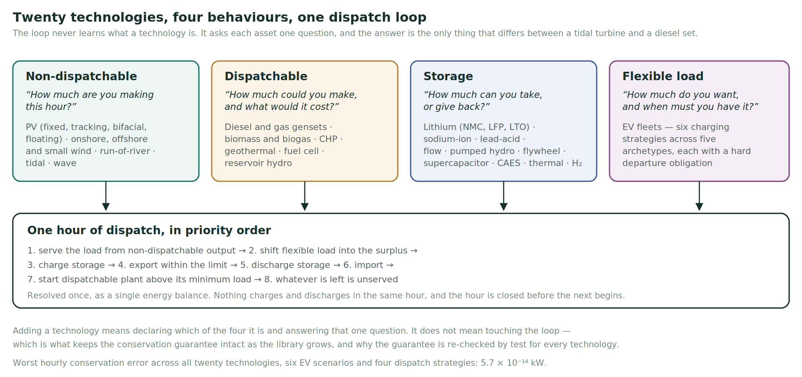

Every technology declares which of four behaviours it has and answers one
question per hour. Tidal stream and rooftop PV are the same thing to the
dispatch: something that produces what it produces. A fuel cell and a diesel
set are the same thing: something that could produce more, at a price. The
consequences are practical:

- **Energy conservation is provable and stays proved.** The worst hourly error
  across all twenty technologies, six EV scenarios and four dispatch strategies
  is 5.7 × 10⁻¹⁴ kW — floating-point noise. It is re-checked by test for every
  technology, so adding a twenty-first cannot quietly break the twentieth.
- **The hour is resolved once.** Nothing charges and discharges in the same
  hour. (In the MATLAB study this project grew out of, several branches of a
  nested `if`/`else` assigned both, double-counting the efficiency loss — see
  [the list of ported defects](#relationship-to-the-matlab-study).)
- **Adding a technology is a small job.** Declare the behaviour, answer the
  question. The loop is not touched.

Four **dispatch strategies** decide the priority order within the hour: load
following, cycle charging, tariff arbitrage, and a rule-based hybrid. The
strategy is a genuine design decision — it changes the answer — so it is
exposed rather than hard-coded.

## 1.4 The money: NPC and LCOE

Two numbers, and you need both.

**Net present cost (NPC)** is everything the system will ever cost, discounted
to today: capital, replacements when components reach end of life, annual O&M,
fuel, grid import net of export revenue, and any penalty on unserved energy.
It is the number to compare designs on, because it is the only one that
captures a cheap machine that has to be replaced twice.

**Levelised cost of energy (LCOE)** is the NPC annualised by the capital
recovery factor and divided by the energy actually served. It is the number to
compare against your tariff, because it is in the same units.

```
CRF = i(1+i)ⁿ / ((1+i)ⁿ − 1)          annualise a present cost
NPC = Σ (present worth of every cash flow over n years)
LCOE = NPC · CRF / annual energy served
```

Three things worth knowing about how this is done here:

- **Replacements are scheduled, not amortised.** A battery with a 12-year life
  in a 20-year project is bought again in year 12, and its salvage value at
  year 20 is credited back. Spreading its cost evenly instead flatters short-
  lived equipment.
- **Real and nominal rates are never mixed.** (`obj.m` in the original study
  used a nominal CRF for components and a real one for grid costs in the same
  levelised figure.)
- **Escalation is applied to operating costs, not capital.** Fuel and tariffs
  rise; a capital cost you already paid does not.

Cost benchmarks for thirty-four technologies across eleven regions come with
the tool, each figure carrying its source and year. They are a starting point
for screening. **The report marks which numbers came from the library and which
you supplied**, because a study built entirely on defaults is a feasibility
sketch, not a design.

## 1.5 The service: LPSP and the four "renewable" numbers

**Loss of power supply probability (LPSP)** is unserved energy divided by total
demand, over the year. 0.02 means 2% of annual energy was not delivered. It is
usually a constraint rather than an objective — the client says "no more than
1%" and everything else is optimised subject to that. Two related numbers are
reported alongside it because the same LPSP can mean very different things:
`unmet_hours` (how many hours had a shortfall) and `longest_shortfall_hours`
(the worst single outage). Two designs at 2% LPSP, one dropping ten minutes a
day and the other dark for a week in January, are not the same product.

Then there are four numbers people routinely confuse:

| Number | Question it answers |
|---|---|
| **Renewable fraction** | Of the energy served, what share came from renewable sources? |
| **Self-sufficiency** | Of my demand, what share did I meet myself rather than importing? |
| **Self-consumption** | Of what I generated, what share did I use rather than exporting? |
| **Curtailment** | Of what I could have generated, what share did I throw away? |

They move in opposite directions. Adding PV to a site raises self-sufficiency
and lowers self-consumption. In the worked example below, the recommended
design reaches 98.9% renewable and 97% self-sufficiency — while curtailing
21.5% of what the array could have produced, 376 MWh a year. That is not a
fault. It is what it costs to get the last few percent from a solar-only
system, and a tool that hid the curtailment number would be hiding the reason
the last few percent are expensive.

## 1.6 Flexible demand: six ways to charge the same cars

An EV fleet is not a load. It is an *obligation* — a quantity of energy that
must be delivered before a departure time — and that is a completely different
thing to optimise against. The control strategy is usually the largest single
decision at a site with EVs, and it is invisible unless everything else is held
constant.

So here is everything else held constant:

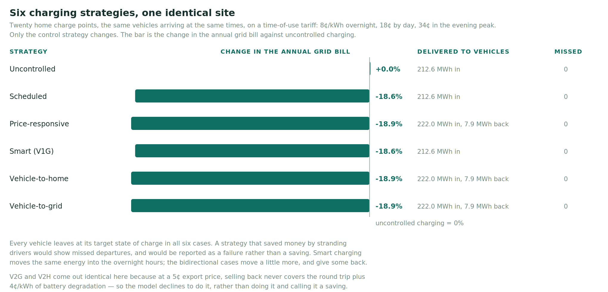

Every number in that figure came from the engine. The important ones are not
the savings; they are the two columns on the right.

- **Missed departures: zero, everywhere.** The departure state-of-charge target
  is a hard service obligation. A strategy that "saves" money by stranding
  drivers is reported as a failure, not a saving. This is the single easiest
  way for an EV model to produce impressive nonsense.
- **Energy delivered differs.** The bidirectional cases move 222 MWh in and
  7.9 MWh back out to deliver the same service as the 212.6 MWh that smart
  charging moves one way. The difference is round-trip loss, and it is charged
  to the bidirectional cases rather than ignored.
- **V2G and V2H come out identical.** At a 5¢ export price, selling back never
  covers the round trip plus 4¢/kWh of battery degradation, so the model
  declines to export at all. It would have been easy to make V2G look better
  than V2H by treating throughput as free. It is not free, and the cars belong
  to somebody.

Six scenarios (uncontrolled, V1G smart, V2G, V2H/V2B, price-responsive,
scheduled) across five archetypes (residential, workplace, depot, public fast,
bus fleet). The archetype matters as much as the strategy: the same smart
charging that saves 18.6% on a residential fleet saves nothing at a workplace,
because workplace cars arrive at 08:00 and leave at 17:00 and the cheap hours
are overnight when nobody is plugged in. There is nothing to shift into.

## 1.7 From kilowatts to copper

The optimiser hands over a number of kilowatts. Turning that into a drawing is
where a sizing tool either earns its keep or quietly produces something
unbuildable.

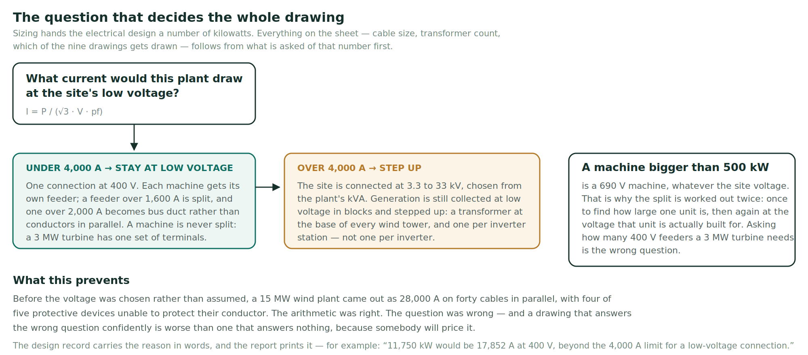

The single most consequential step is one that most tools skip: **deciding the
voltage before sizing anything**. Assume 400 V and a multi-megawatt plant comes
out as tens of thousands of amps on dozens of parallel cables, with protective
devices that cannot protect their conductors. Every number in that drawing is
arithmetically correct and the drawing is worthless — worse than worthless,
because somebody will price it.

Downstream of that decision:

- **Cables** are sized against three criteria — ampacity (IEC 60364-5-52),
  voltage drop, and short-circuit withstand — and the schedule names which one
  governed. That matters: a conductor governed by voltage drop gets smaller if
  you shorten the route, and one governed by short-circuit withstand does not.
- **Protection** is coordinated so both IEC 60364-4-43 conditions hold
  simultaneously: I_B ≤ I_N ≤ I_Z, and I₂ ≤ 1.45·I_Z. Devices that satisfy the
  first and fail the second are the classic near-miss.
- **PV strings** are checked at both ends of the temperature range: the
  cold-day open-circuit voltage against the inverter's maximum, and the hot-day
  MPP voltage against its MPPT minimum. A string that passes at 25 °C can
  destroy an inverter at −5 °C.
- **The drawing is chosen, not templated.** Nine connection arrangements are
  recognised from the design — a single-phase rooftop array through to an MV
  customer connected via ring main units — because a 5 kW rooftop and a 5 MW
  plant are not the same drawing with different labels.

---

# Part 2 — Using the software

Nine pages, left to right. Each one is usable as soon as the one before it is
done, and the sidebar shows how far along you are.

The screenshots below are a real study: a **300 kW-peak commercial site in
Shiraz, Iran**, with PV, wind, battery, a standby generator, a grid connection
and twelve workplace EV charge points. Everything shown was produced by the run
that made these images.

### Step 1 — Site

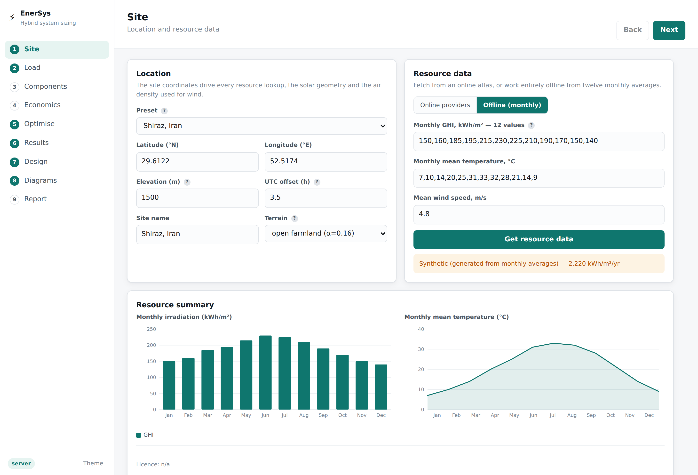

Coordinates drive every resource lookup, the solar geometry and the air density
used for wind. Three fields deserve more attention than they usually get:

- **Elevation** sets air density. At 1,500 m the air is 13% thinner and a wind
  turbine produces proportionally less. Getting this wrong flatters wind.
- **UTC offset** is needed for solar position. An hour out shifts the PV output
  by an hour — which barely changes annual energy and completely changes how
  well PV lines up with an evening peak.
- **Terrain** sets the wind shear exponent used to translate measured wind
  speed to hub height.

Then choose where the weather comes from. **Online providers** gives you PVGIS
(TMY or a named year), NASA POWER, or Open-Meteo/ERA5. **Offline** takes twelve
monthly irradiation totals and twelve monthly mean temperatures — readable off
the Global Solar Atlas page for your site — and synthesises an hourly year that
matches the monthly energy exactly. That path is what the screenshots use, and
it is labelled *synthetic* everywhere it appears, because a generated year has
no cloud persistence and will therefore **undersize storage**. Use it to scope
a project, not to sign one off.

### Step 2 — Load

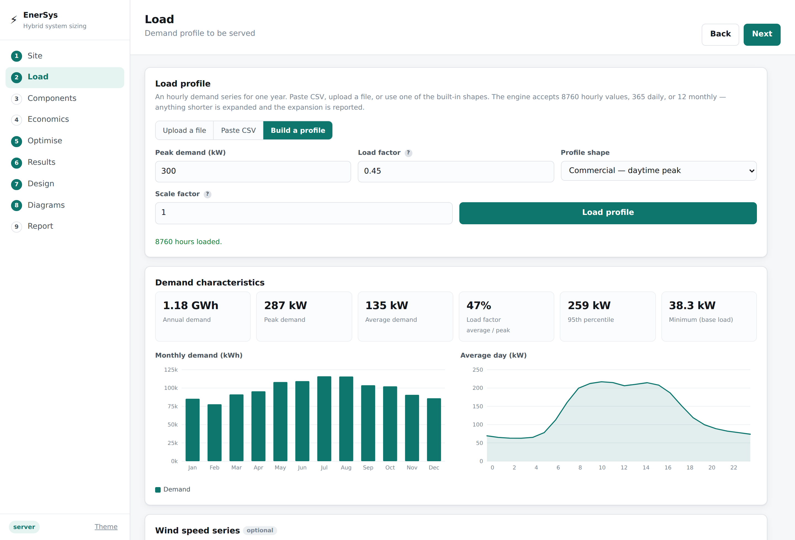

An hourly demand series for one year. Upload a CSV, paste one, or build a
profile from a peak, a load factor and a shape. The engine accepts 8,760 hourly
values, 365 daily, or 12 monthly — anything shorter is expanded and **the
expansion is reported**, so a monthly profile never silently masquerades as
measured data.

Load factor is the number people misjudge. Offices run 0.3–0.4; continuous
process plant 0.7–0.9. It moves the answer more than almost anything else on
this page, because it decides whether storage is arbitraging a peaky profile or
just sitting there.

### Step 3 — Components

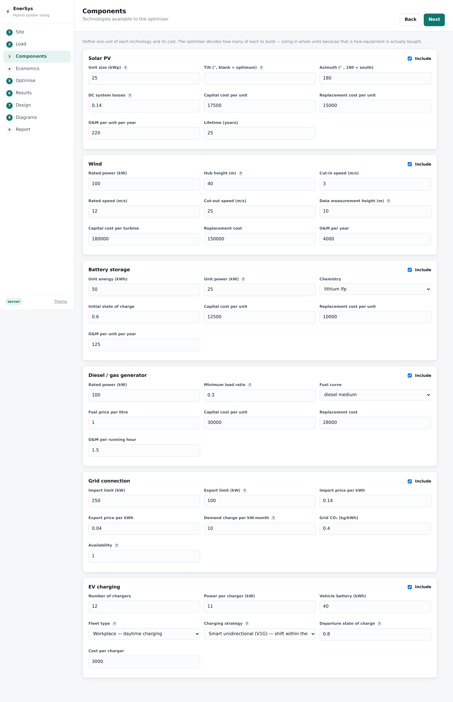

Here you define **one unit** of each technology and what it costs. The
optimiser decides how many to build.

Choosing the unit size is a real decision. Small units give the search fine
resolution and a large space to explore; large ones search faster but quantise
the answer coarsely. 25 kWp PV units on a 300 kW site is a reasonable balance —
34 possible values along that axis. 250 kWp units would give you four.

The EV card is worth dwelling on. **Fleet type** sets who plugs in and when:
arrival and departure times, the state of charge they arrive at, and how long
they stay all differ by an order of magnitude between a home driveway and a bus
depot. **Charging strategy** picks one of the six from
[§1.6](#16-flexible-demand-six-ways-to-charge-the-same-cars). Both change the
answer far more than the charger rating does.

### Step 4 — Economics

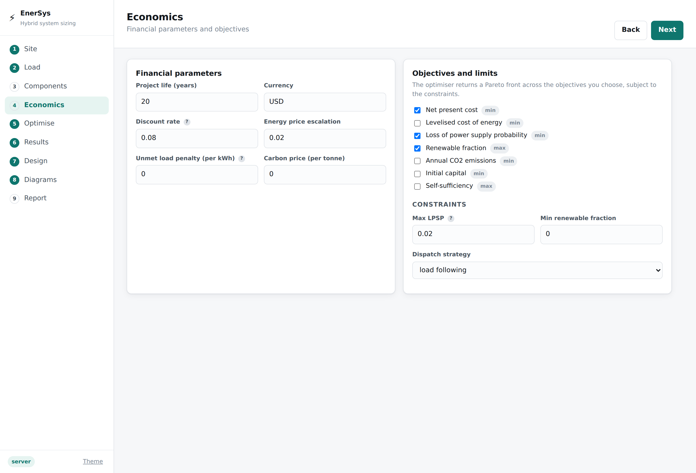

Project life, discount rate, escalation, currency, and the objectives and
constraints for the search.

Choose **at least two objectives** — a Pareto front needs a trade-off, and with
one objective there is nothing to trade. The default three (NPC, LPSP,
renewable fraction) suit most studies. Constraints go here too: a maximum LPSP
is the usual one, and a minimum renewable fraction is common when there is a
corporate target to hit.

### Step 5 — Optimise

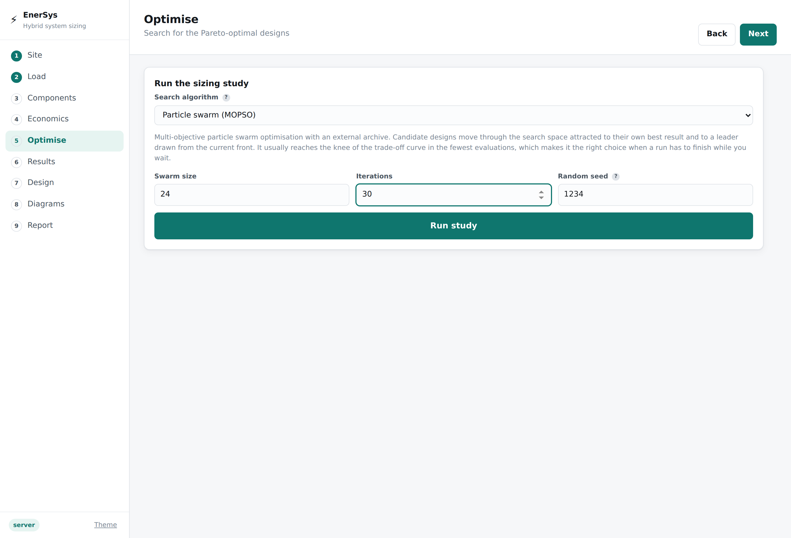

Pick a search algorithm, a population size, a number of iterations and a seed.

| | | |
|---|---|---|
| **Particle swarm (MOPSO)** | multi-objective PSO with an external archive | fastest to a good compromise; the default |
| **Genetic algorithm (NSGA-II)** | Deb et al. (2002), elitist non-dominated sorting | evener spread; finds the extremes of the front more reliably |
| **Exhaustive search** | every combination simulated | exact, no random seed; small studies only |

All three evaluate designs identically — same dispatch, same economics, same
metrics — so a design cannot be worth more under one algorithm than another.
Only the exploration differs. That is what makes the second opinion useful:
**running the same study twice with two unrelated searches is the cheapest test
of whether a front has actually converged.** The regression suite does exactly
this, checking both metaheuristics against an enumerated ground truth on a
problem small enough to enumerate.

When the search space is small enough to enumerate within the evaluation
budget, the exhaustive search reports its front as *exact*. When it is not, it
falls back to a uniform coarse grid over the whole box and says so, rather than
implying a proof it did not perform.

**Fix the seed.** A result nobody can reproduce cannot be defended. (The
exhaustive search ignores it, and greys the field out, because it has no random
element.)

Then run it. The example took 30 seconds to evaluate 372 designs and returned
16 on the front:

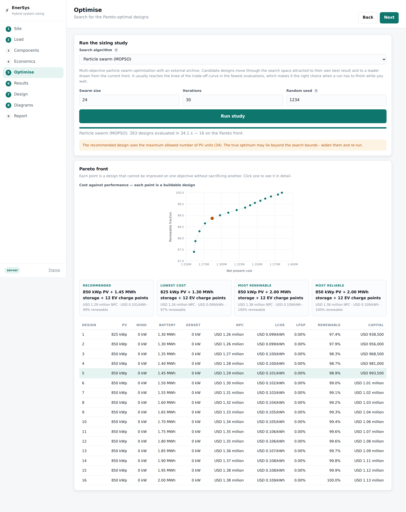

Four designs are called out — recommended (the knee), lowest cost, most
renewable, most reliable — and the full front is tabulated below. Click any
point to carry it forward.

Note the warning above the chart: *"The recommended design uses the maximum
allowed number of PV units (34)."* A design sitting on a search boundary is not
an optimum, it is a truncated search. The tool says so instead of presenting it
as an answer. Widen the bounds and re-run.

### Step 6 — Results

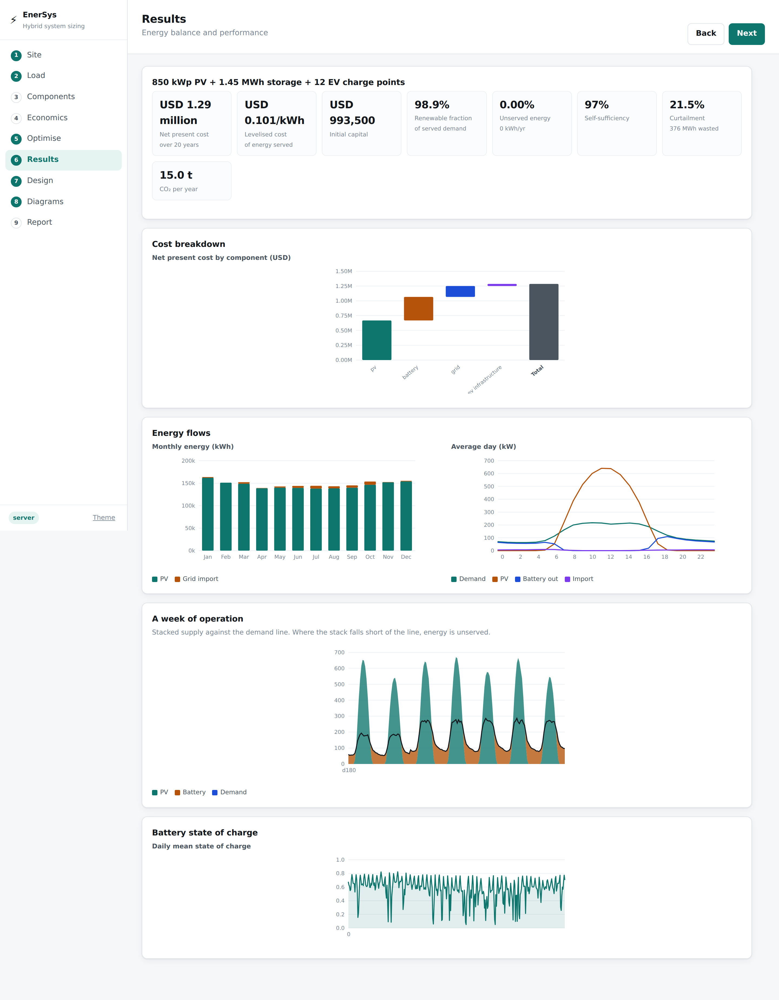

What the chosen design actually does over the year: cost breakdown by
component, monthly energy, an average day, a sample week of operation stacked
against the demand line, and the battery's state of charge across the year.

The KPI strip is where to look first. In this example: USD 1.29 million NPC,
USD 0.101/kWh LCOE, 98.9% renewable, **0.00% unserved**, 97% self-sufficiency,
21.5% curtailment, 15.0 t CO₂ per year.

Read the state-of-charge chart before you believe the rest. A battery that
never comes off its ceiling is oversized; one that sits on the floor all winter
is undersized and something else is carrying the site.

### Step 7 — Design

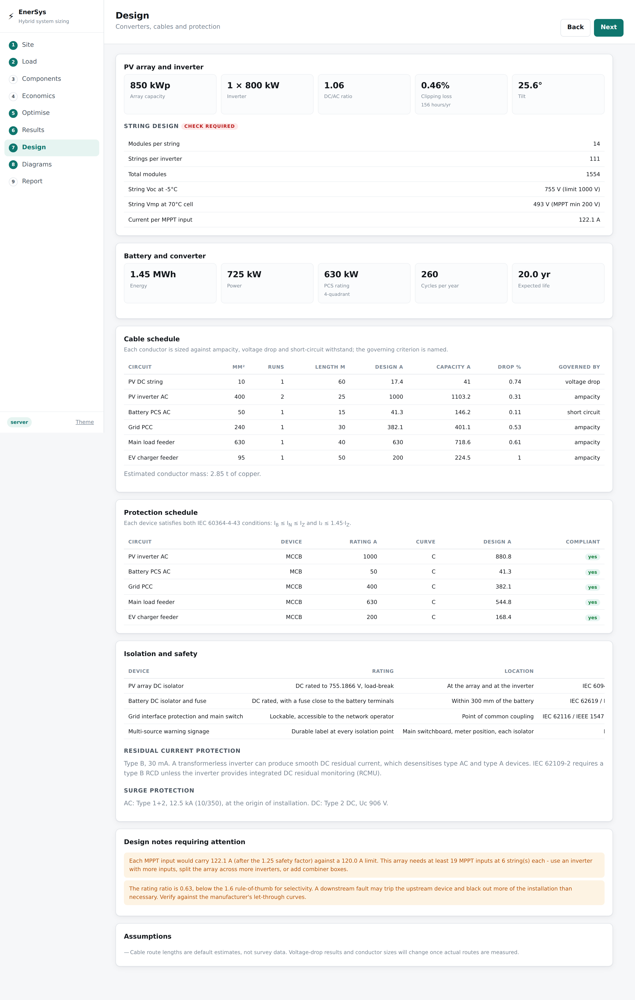

This is where kilowatts become equipment. Inverter selection from the actual
clipping curve (here: one 800 kW inverter, DC/AC 1.06, 0.46% clipping loss over
156 hours a year), the string layout with both temperature checks, the battery
converter, the cable schedule with the governing criterion named for every
conductor, the protection schedule with the IEC 60364-4-43 compliance column,
and isolation and safety.

And then the part that matters most:

> **Design notes requiring attention**
>
> *Each MPPT input would carry 122.1 A (after the 1.25 safety factor) against a
> 120.0 A limit. This array needs at least 19 MPPT inputs at 6 strings each —
> use an inverter with more inputs, split the array across more inverters, or
> add combiner boxes.*
>
> *The rating ratio is 0.63, below the 1.6 rule-of-thumb for selectivity. A
> downstream fault may trip the upstream device and black out more of the
> installation than necessary. Verify against the manufacturer's let-through
> curves.*

Neither of those is fatal and neither is hidden. This is the behaviour to
expect from the tool throughout: when something needs a human, it says what,
why, and what would fix it.

### Step 8 — Diagrams

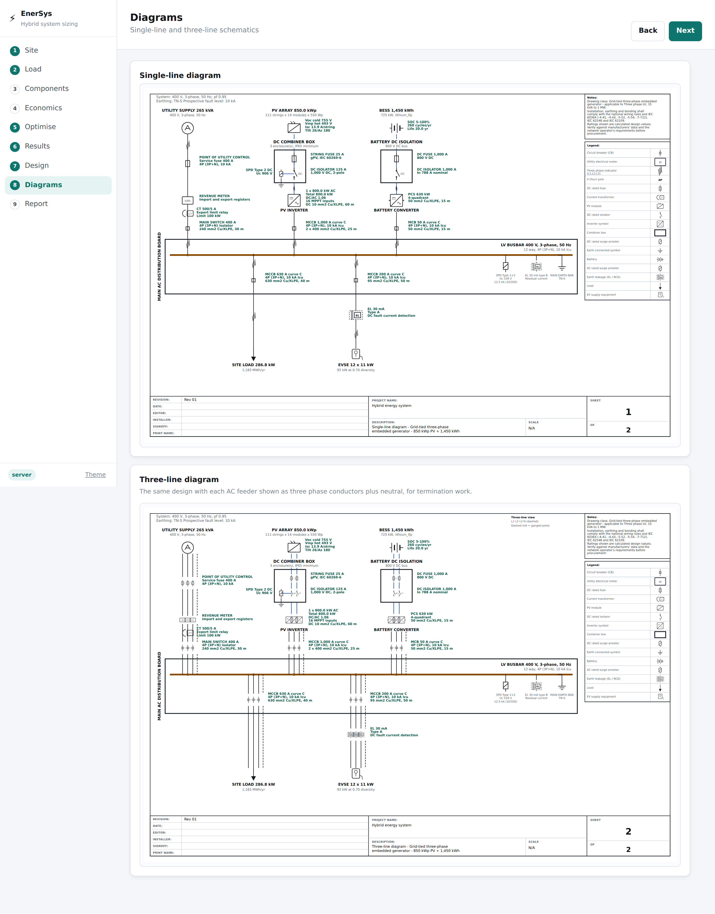

Two sheets, generated from the same design record as the schedules, so the
drawing cannot drift out of step with the numbers.

The **single-line diagram** carries every rating the calculation produced:
point of utility control, metering and CT ratio, main switch, DC isolator
voltage class from the cold-day Voc, string and battery DC fusing, converter
ratings, feeder protection with pole count and breaking capacity, conductor
size and route length, earthing, surge and residual-current protection. It has
a title block, a legend built from the symbols actually used, and the standards
notes.

The **three-line diagram** is the same design with each AC feeder drawn as
three phase conductors plus neutral, with the dashed gang bars that say the
poles operate together — the view you need for termination work.

### Step 9 — Report

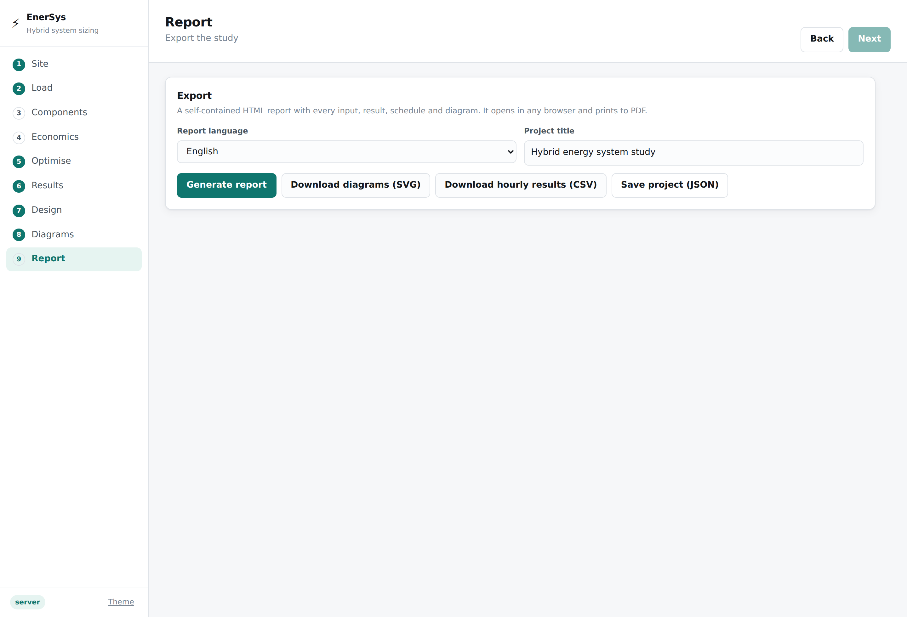

Generate a self-contained HTML report in English or Persian, and export the
diagrams as SVG, the hourly results as CSV, or the whole project as JSON.

**Save project (JSON)** writes the entire study — the site, the resource
settings, the demand, the cost basis, every component field, the economics and
the search settings — into one readable file. **Open project**, at the top
right of any page, reads it back, retrieves the resource, rebuilds the demand
and leaves you on the Optimise page ready to run. That is how the studies in
[`examples/`](examples/) are shipped, and it is the way to hand a study to a
colleague or to pick one up six months later.

Two limits of the format. A demand profile loaded **from a file** cannot be
stored inside a project — no web page is permitted to hand a file back to a
file input — so a project saved that way restores everything else and asks for
the CSV again. And only the technologies that are switched on, plus the five
sizable ones and the grid, are written; anything the file does not mention is
left off, which is what it was.

---

# Part 3 — A worked example, end to end

The site in Part 2 stayed at low voltage. Here is the same tool on a job an
order of magnitude larger, to show what changes.

**The brief.** An industrial site near Shiraz. 1,500 kW peak, 0.70 load factor,
two-shift operation. Mean wind 6.5 m/s at 10 m. An existing 800 kW grid
connection with 98% availability, a 14¢/kWh tariff and a 12/kW-month demand
charge. Sixteen 22 kW depot chargers for the site's vehicles. PV in 100 kWp
blocks, 500 kW turbines, 250 kWh battery modules, a 250 kW standby set.

**The search.** MOPSO, 24 particles, 30 iterations: 733 designs evaluated in
53 seconds, 148 on the front.

**The recommendation.** 4,300 kWp of PV, two 500 kW turbines, 11.5 MWh of
storage, the 250 kW standby set, and the sixteen chargers.

Now watch what that does to the electrical design.

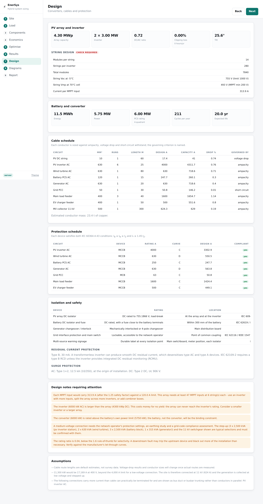

The plant no longer fits on a low-voltage connection, and the tool says so in
words before it says anything in numbers. The site is connected at **22 kV**
with a 968 kVA connection; generation is still collected at 400 V and stepped
up through **three 2,500 kVA transformers, Dyn11, 6.5% impedance**, carrying
3,608 A on the LV side and 193 A on the MV side.

Three 2,500 kVA units — not forty-three 100 kVA ones. Inverters are grouped
into stations that share a transformer; a wind turbine gets its own, at the
base of its own tower, because you cannot run its low-voltage cable back to a
central point. That distinction is in the code and in the tests, because
getting it wrong produces a drawing that is arithmetically correct and
obviously drawn by a machine.

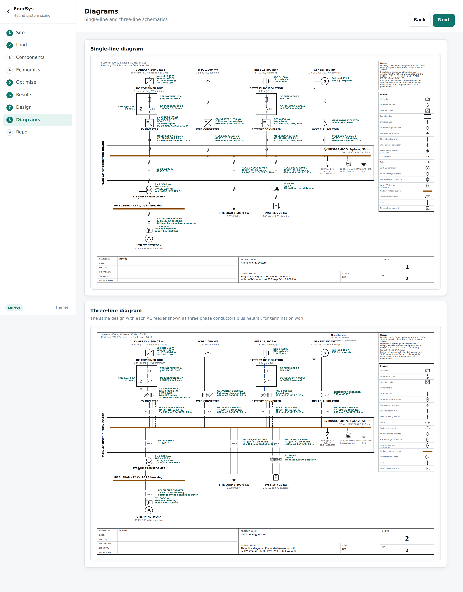

The drawing class changed by itself. It is now *"Embedded generator with LV/MV
step-up"*, and it carries what that class needs: the step-up, an MV busbar with
its 20 kA breaking duty, the MV circuit breaker with a note that the settings
belong to the network operator, a 2000/5 A CT for revenue metering with the
export limit stated, and the utility network at the bottom. The notes panel
carries the drawing class and its scope, and the warning that an MV connection
needs the operator's protection settings, an earthing study and a grid-code
compliance assessment.

Compare that with [step 8](#step-8--diagrams) above. Same tool, same code path,
same design record — a different drawing, because it is a different kind of
installation.

---

# Part 4 — Under the hood

## Layout

```
ensys/                  the engine, standard library only
  timeseries.py         8760-hour series handling
  system.py             component sets and the search space
  dispatch.py           hourly energy management
  economics.py          NPC, LCOE, present-worth factors
  metrics.py            LPSP, renewable fraction, self-sufficiency
  optimise.py           top-level sizing driver
  validate.py           plausibility checks on inputs and results
  api.py                JSON API shared by both transports
  assets.py             the four behaviours every technology reduces to
  catalogue.py          technology registry and UI schema
  costs.py              worldwide cost benchmarks, 11 regions
  i18n.py               English and Persian, 197 strings
  models/               pv, wind, battery, genset, grid, generators,
                        storage, evfleet
  resources/            geo, providers, cache, synthesis
  optim/                pareto, base, mopso, nsga2, exhaustive,
                        algorithms, screen
  sizing/               inverter, cables, protection, voltage, design
  diagram/              symbols, sheet, topology, sld
web/                    interface: index.html, app.js, boot.js, charts.js
docs/images/            the figures in this README
examples/               three loadable worked projects
tests/                  207 regression tests
server.py               stdlib HTTP server
desktop.py              native window
doctor.py               installation self-check
START_HES.bat       Windows launcher, browser application
START_HES.py        Windows launcher for systems that block .bat files
run.sh                  Linux and macOS launcher
```

## The JSON API

Both transports — the local HTTP server and the in-browser Pyodide build — call
the same `ensys.api.handle(action, payload)`. Anything the interface can do is
scriptable:

```python
from ensys import api

api.handle("fetch_resources", {"session": "s1", "mode": "offline",
                               "location": {...}, "monthly_ghi": [...]})
api.handle("import_series", {"session": "s1", "name": "load", "values": [...]})
r = api.handle("run_study", {"session": "s1", "config": {...},
                             "algorithm": "nsga2", "particles": 24,
                             "iterations": 30})
d = api.handle("detail", {"session": "s1", "index": r["recommended_index"]})
```

Actions: `info`, `catalogue`, `costs`, `translations`, `ev_scenarios`,
`optimum_tilt`, `fetch_resources`, `import_series`, `run_study`, `detail`.

## Adding a technology

1. Write the model in `ensys/models/`, exposing the one method its behaviour
   requires (`output_series`, `max_output_kw`, `max_charge_kw` /
   `max_discharge_kw`, or `preferred_charge_kw` / `preferred_discharge_kw`).
2. Register it in `ensys/catalogue.py` with its behaviour class and its UI
   schema. The form and the option lists build themselves from that.
3. Add its cost benchmark to `ensys/costs.py`, with the source.
4. Add the module to the `MODULES` list in `web/boot.js` — Pyodide has no
   directory listing, so the browser build needs the file named explicitly.
   There is a test that fails if you forget.

You do not touch `dispatch.py`.

## Adding an optimisation algorithm

1. Write it in `ensys/optim/`, taking `(space, evaluate_fn, **kwargs)` and
   exposing `run(seed_points=None)` that returns an `optim.base.SearchResult`.
   `optim/base.py` provides the memoised evaluator, the stall-and-time-budget
   stopwatch, and the shared result shape.
2. Add one entry to `_ALGORITHMS` in `ensys/optim/algorithms.py`, with a label
   and a description written for the person choosing rather than the person
   maintaining.
3. Add the module to `web/boot.js`.

Nothing else changes. The study looks the algorithm up by key, the API serves
the catalogue to the interface, and the interface builds its menu from what it
is served — so there is no hard-coded list of algorithm names anywhere
downstream.

## Tests

```bash
python -m unittest discover -s tests     # 207 tests
```

The ones that matter most are the conservation and coordination tests. A sizing
tool can produce plausible-looking numbers indefinitely while quietly losing
energy or specifying a breaker that cannot protect its cable, and neither
failure announces itself. Also in there: the exhaustive-vs-metaheuristic
agreement test (§Part 2, step 5), the string-voltage checks at both temperature
extremes, the EV departure-obligation tests, and a guard that fails when a
module is added to the package but not to the browser build's module list.

See [Validation and tests](#validation-and-tests) for what the suite covers and
what it does not.

---

## Relationship to the MATLAB study

The engine generalises the wind–battery–EV–grid PSO study this project grew out
of, published as:

> J. Hosseinzadeh, **E. Roshandel** and H. Attar, "Energy management in a
> commercial-site equipped with electric vehicle charging stations, wind
> turbines, and battery energy storages," *2023 2nd International Engineering
> Conference on Electrical, Energy, and Artificial Intelligence (EICEEAI)*,
> IEEE, 2023, pp. 1–6.
> [IEEE Xplore](https://ieeexplore.ieee.org/abstract/document/10590218/)

That study sized wind turbines and battery storage for a commercial site whose
car park charges an uncertain number of electric vehicles, treating arrival and
departure times as the principal uncertainty and building the demand model from
a year of measured consumption. Three things carried straight into this
program: the objective — maximise the use of the wind generation while
minimising dumped energy — the treatment of the fleet as a load whose timing is
a variable rather than a given, and the life-cycle cost accounting over
purchase, installation and maintenance. What is generalised here is the scope:
one site becomes any site, two technologies become twenty, one objective
becomes a Pareto front, and the resource comes from measured or satellite data
rather than a single wind series.

`windt.m`, `NPC.m`, `rep.m`, `nextgen.m`, `xi.m`, `limmin.m` and `limmax.m`
port across directly and their behaviour is preserved. Eight things were found
and changed, and the reasons are recorded in the code. The first three are
defects in the model; the rest are defects in the search or the accounting
around it:

1. **Battery discharge ignored the efficiency term.** `sim4.m` computes the
   available discharge as `Nbb*BBnomE*(SOC(t)-SOCmin)`, then divides by the
   efficiency when updating the state of charge. The bank is therefore
   discharged past `SOCmin` by roughly `1/η` every time it is drained — a few
   percent per event, cumulative over a year, and always in the direction that
   flatters the battery. `Battery.max_discharge_kw` scales the available energy
   by the efficiency so the state of charge lands exactly on the floor. There
   is a regression test for it.

2. **The EV connection window was empty overnight.** `Hour >= Arr and Hour <=
   Dep` yields nothing whenever arrival is in the evening and departure the
   next morning — the ordinary commuter pattern — so an overnight fleet
   silently never charged. The window now wraps midnight explicitly.

3. **The battery could charge and discharge in the same hour.** Several
   branches of the nested `if`/`else` assigned both `Pbb_in` and `Pbb_out` from
   the same surplus test, double-counting the efficiency loss. The hour is now
   resolved once as a single energy balance with an explicit priority order,
   and a test asserts the two are never simultaneously non-zero.

4. **The EV decision variable never reached the simulation.** `mainWT.m`
   searches `EVrange = [1, 10]` as the third PSO dimension, but `sim4.m` reads
   only `X(1)` and `X(2)` — `Nev` comes from `EV_av(t)`. With
   `EVcostU = [0,0,0]` it does not reach the cost either, so a third of the
   swarm's effort explores a dimension that cannot change the objective.

5. **The energy-balance constraint was never enforced.** `h = 1` is the only
   assignment to `h` in `sim4.m`, so `S(1)` is always 1: the `while S(1)==0`
   feasibility loops never iterate and the `fX = 1/eps` rejection never fires.
   Every particle was accepted regardless of whether it balanced.

6. **The seasonal tariff was discarded.** `mainWT.m` line 32 builds an
   8760-hour monthly price vector; line 35 overwrites it with the scalar `0.3`.

7. **`alpha = 1`** as a terrain friction coefficient is physically wrong
   (typical values are 0.14–0.4), harmless only because `Href == Hhub == 10`
   makes the correction exactly 1.0.

8. **`obj.m`** mixes a nominal capital recovery factor for components with a
   real one for grid costs in the same COE; `AEB = 79090.5` is a hardcoded
   baseline driving payback; and the IRR cash flow `[-capx, -Gridx'+opex']`
   adds O&M as a positive return, so that IRR is not meaningful.

---

## Validation and tests

207 checks, no test dependencies, `python -m unittest discover -s tests`.
They fall into four groups.

**Conservation.** Energy in equals energy out, every hour, for every
technology and every dispatch strategy. This is the one that catches real
damage: a merit-order change that double-counted spare capacity was caught by
the CHP conservation test at hour 12, not by anything that looked at the
answer.

**Agreement.** The metaheuristics are required to find the same front as the
exhaustive enumeration on a search space small enough to enumerate. If MOPSO
and NSGA-II both drift away from the exact answer, this fails.

**Physics and plausibility.** `ensys/validate.py` carries published ranges for
specific yield, capacity factor, load factor, LCOE and per-unit costs, and
`tests/test_plausibility.py` checks both the ranges and the code that applies
them. This layer exists because of a real failure: a timezone misalignment
between the resource providers and the solar position model suppressed the
photovoltaic yield by 25% at one site and 86% at another, and nothing in the
program noticed. It does now — a yield outside the published band for the
latitude is reported on the page rather than quietly optimised around.

**Coordination.** A breaker that cannot protect its cable, a string voltage
that exceeds the inverter at the record low temperature, an EV fleet that
misses its departure obligation. These are the ones a reviewer would catch and
the program should catch first.

What the suite does **not** establish: that the cost library is current, that
the resource data is accurate at your site, or that a design is buildable.
Those are in [`DISCLAIMER.md`](DISCLAIMER.md), and they are not small.

---

## Running it online

The same code runs with no server at all. Open `web/index.html` directly, or
visit the [live demo](https://emadroshandel.github.io/Hybrid_Energy_System/): the page finds
no server, loads Pyodide from a CDN, and runs the identical Python engine
inside the browser. Every calculation happens on the visitor's machine, and no
demand profile, site or result is uploaded anywhere, because there is nowhere
to upload it to.

---

## Limits worth knowing

- One simulated year at hourly resolution. Sub-hourly peaks and inter-annual
  weather variation are not captured; run several years separately if
  variability matters.
- The dispatch is rule-based, not a rolling-horizon optimisation. It does not
  anticipate tomorrow's weather.
- Wake losses are a flat derate, not a layout model.
- EV fleets carry one aggregate state of charge, not one per vehicle, so
  individual departure compliance is approximate. A handful of reported
  near-misses a year is aggregation noise; a systematic failure shows up as
  percentages, and the report gives the rate so the two can be told apart.
- Cost benchmarks are 2024 figures and will date. Regional multipliers are
  indicative and a specific project can sit well outside its region's.
- Cable route lengths default to estimates until you enter surveyed values, and
  the report says which numbers depend on that.
- Component ratings are matched to standard product sizes for screening. Verify
  against manufacturer data before procurement.
- Synthetic weather has no cloud persistence and will undersize storage.
- This is a design aid. It does not replace a qualified engineer's review, a
  site survey, or compliance sign-off against the local wiring rules.

---

## Troubleshooting

**`python` is not recognised (Windows).** Install Python 3.9 or newer from
python.org and tick *Add Python to PATH* during the installation. Then run
`START_HES.bat` again.

**The launcher window closes immediately.** It is not supposed to; that is
what `START_HES.bat` keeps it open for. If it still happens, your security
software is blocking the batch file — double-click `START_HES.py` instead.

**The page loads but stays on the splash.** It names the stage it is waiting
at after a few seconds. If it cannot reach `cdn.jsdelivr.net`, the network is
blocking the CDN; the local server mode does not need it.

**The dropdowns and component cards are empty.** The interface script stopped
before it finished building the page. Open the browser console (F12) and read
the first error — everything after it is a consequence.

**"Get resource data" fails.** Try another provider; PVGIS, Open-Meteo and
NASA POWER cover different regions and have different outages. If all three
fail, switch to *Monthly averages* and enter twelve numbers — a full study
needs nothing more.

**The answer is implausibly large.** Check the demand profile first. It is the
single largest influence on every result, and a peak entered in the wrong unit
moves the whole answer by that factor. The Load page prints the annual energy
and the load factor: compare them with a bill. The findings box on each page
flags values outside published ranges.

**The generator is never dispatched.** It competes on marginal cost, so it
only runs when it is cheaper than the alternative for that hour. Compare its
fuel price and O&M per hour against the grid import price; on an island with
no grid it will run whenever the battery cannot cover the deficit.

**A test fails after an edit to `web/app.js`.** `tests/test_plausibility.py`
checks the interface script for names it calls and never defines, and checks
that the worked examples still match the save format. Both failures name what
is missing.

---

## Contributing

Issues and pull requests are welcome. A few things that will make a change
easy to accept:

- **No new dependencies in `ensys/`.** The standard-library constraint is the
  reason this runs in a browser, on an air-gapped machine, and on whatever
  Python is already installed. Optional accelerators are fine if the code
  works without them.
- **A test with the change.** `python -m unittest discover -s tests` must pass
  before and after. A bug fix without a test that would have caught it will
  come back.
- **Run `python doctor.py`** before opening the pull request.
- **Adding a technology** takes one entry in `ensys/catalogue.py` and one model
  class implementing one of the four behaviours — see
  [Adding a technology](#adding-a-technology). The interface builds itself from
  the catalogue, so there is no interface change to make.
- **Changing the project file format** means regenerating `examples/*.json`;
  the test suite fails if they drift.

Say what the change is for in the pull request, not only what it does. A
sizing tool is judged by whether its answers can be defended, so the reasoning
matters as much as the code.

---

## Authorship

This project was created by two authors with a clear division of labour: one is a conventional human, and the other is a highly capable artificial intelligence.

> **Engineering and methods** — Emad Roshandel
> **Software and interface** — Claude (Opus)

**Engineering and methods** means the part that decides whether an answer is
right. The problem itself; the wind–battery–EV–grid PSO study this generalises
from; the choice of which model to use at each step of the chain and which
published formulation of it; what a plausible specific yield, capacity factor
or LCOE looks like at a given latitude; which trade-offs a sizing study is
actually meant to expose; and, throughout, the review that separated a result
worth reporting from one that merely looked like one. That is Emad Roshandel's,
and it is not a supervisory role: it is the content.

**Software and interface** means the part that turns those decisions into a
program. The Python package, the hourly dispatch, the optimisers, the web
interface, the charts and diagrams, the test suite and these documents were
written by Claude (Anthropic's Opus model), working from that direction.

What follows from this, for anyone reading the code: the physics and the
economics have an author who is accountable for them, and they were checked
against what the equipment actually does. The implementation has an author
too, and 207 tests, and neither of those is a substitute for reading it
yourself before you rely on it.

---

## Citation

If you use HES in academic work, please cite it. [`CITATION.cff`](CITATION.cff)
carries the machine-readable form, and GitHub renders a *Cite this repository*
button from it.

```bibtex
@software{roshandel_hes,
  author  = {Roshandel, Emad},
  title   = {{HES}: multi-objective sizing of hybrid renewable
             energy systems},
  version = {0.1.0},
  url     = {https://github.com/emadroshandel/Hybrid_Energy_System},
  license = {GPL-3.0-or-later}
}
```

If you are citing the method rather than the tool, the study this engine
generalises is the one to cite:

```bibtex
@inproceedings{hosseinzadeh2023energy,
  author    = {Hosseinzadeh, Javad and Roshandel, Emad and Attar, Hani},
  title     = {Energy management in a commercial-site equipped with electric
               vehicle charging stations, wind turbines, and battery energy
               storages},
  booktitle = {2023 2nd International Engineering Conference on Electrical,
               Energy, and Artificial Intelligence (EICEEAI)},
  publisher = {IEEE},
  year      = {2023},
  pages     = {1--6}
}
```

If your study used resource data retrieved through the program, cite the data
provider as well — the program names it on the Site page and in the generated
report, and [`THIRD_PARTY_NOTICES.md`](THIRD_PARTY_NOTICES.md) gives the
required attribution for each.

---

## Licence and attribution

HES is free software released under the **GNU General Public License
v3.0 or later**; the full text is in [`LICENSE`](LICENSE). You may use, study,
modify and redistribute it, and any distributed derivative must carry the same
licence and make its source available.

Read [`DISCLAIMER.md`](DISCLAIMER.md) before using a result for anything that
gets built. It is short and it is the part that matters.

Resource data carries the licence of its provider: Global Solar Atlas is
CC BY 4.0 (Solargis / World Bank), Open-Meteo CC BY 4.0, NASA POWER public
domain, PVGIS free reuse with attribution, and **Renewables.ninja is CC BY-NC
4.0 — non-commercial use only**, which matters if you are producing work for a
client.

Full provider attributions, the Pyodide and NumPy notices, and the standing of
the cost library are in [`THIRD_PARTY_NOTICES.md`](THIRD_PARTY_NOTICES.md).

### References

**Work by the author.** The first is the study this engine generalises, and is
described in [Relationship to the MATLAB
study](#relationship-to-the-matlab-study). The second is related smart-grid
work from the same group — PCA and LDA feeding an augmented K-NN classifier for
fault detection and classification — listed as background rather than as a
component: no part of it is implemented here.

- J. Hosseinzadeh, **E. Roshandel** and H. Attar, "Energy management in a
  commercial-site equipped with electric vehicle charging stations, wind
  turbines, and battery energy storages," *2023 2nd International Engineering
  Conference on Electrical, Energy, and Artificial Intelligence (EICEEAI)*,
  IEEE, 2023, pp. 1–6.
  [IEEE Xplore](https://ieeexplore.ieee.org/abstract/document/10590218/)
- J. Hosseinzadeh, F. Masoodzadeh and **E. Roshandel**, "Fault detection and
  classification in smart grids using augmented K-NN algorithm," *SN Applied
  Sciences*, vol. 1, no. 12, art. 1627, 2019.
  [Springer](https://link.springer.com/article/10.1007/s42452-019-1672-0)

**The models implemented here**, in the order the calculation uses them:

- Michalsky, J. J. (1988). The Astronomical Almanac's algorithm for
  approximate solar position. *Solar Energy* **40**(3), 227–235.
- Erbs, D. G., Klein, S. A. & Duffie, J. A. (1982). Estimation of the
  diffuse radiation fraction for hourly, daily and monthly-average global
  radiation. *Solar Energy* **28**(4), 293–302.
- Hay, J. E. & Davies, J. A. (1980). Calculation of the solar radiation
  incident on an inclined surface. *Proc. First Canadian Solar Radiation Data
  Workshop*, 59–72.
- Faiman, D. (2008). Assessing the outdoor operating temperature of
  photovoltaic modules. *Progress in Photovoltaics* **16**(4), 307–315.
  Also IEC 61853-2.
- Duffie, J. A. & Beckman, W. A. (2013). *Solar Engineering of Thermal
  Processes*, 4th ed. Wiley.
- IEC 61400-12-1, *Power performance measurements of electricity producing
  wind turbines* — the air-density correction applied to the power curve.
- Justus, C. G. et al. (1978). Methods for estimating wind speed frequency
  distributions. *J. Applied Meteorology* **17**(3), 350–353.
- Deb, K. et al. (2002). A fast and elitist multiobjective genetic algorithm:
  NSGA-II. *IEEE Trans. Evolutionary Computation* **6**(2), 182–197.
- Coello Coello, C. A., Pulido, G. T. & Lechuga, M. S. (2004). Handling
  multiple objectives with particle swarm optimization. *IEEE Trans.
  Evolutionary Computation* **8**(3), 256–279.
- IEC 60364-7-712 and IEC 62548 for the photovoltaic electrical design;
  IEC 60287 for cable current ratings; IEC 60909 for fault levels.
- Pfenninger, S. & Staffell, I. (2016). Long-term patterns of European PV
  output. *Energy* **114**, 1251–1265, and the companion wind paper — the
  basis of the Renewables.ninja series.
